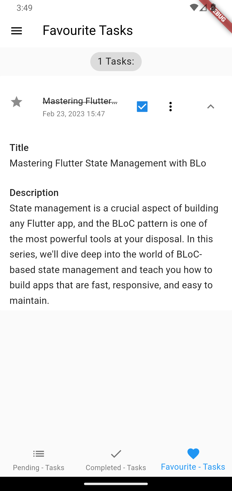
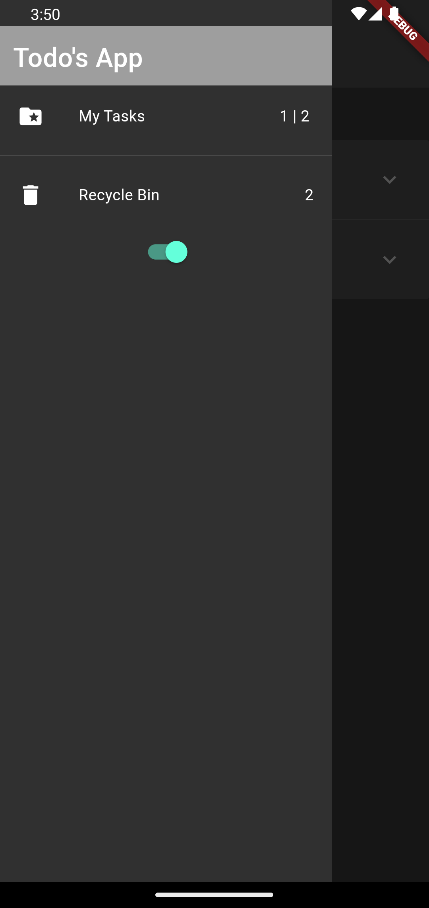

## 1) Building Robust Apps with Flutter BLoC
Description: In this series, you will learn how to build robust and scalable Flutter apps using the BLoC pattern. We'll cover everything from the basics of setting up your project to advanced topics like handling asynchronous data and managing complex UIs.
## 2) Mastering Flutter State Management with BLoC
Description: State management is a crucial aspect of building any Flutter app, and the BLoC pattern is one of the most powerful tools at your disposal. In this series, we'll dive deep into the world of BLoC-based state management and teach you how to build apps that are fast, responsive, and easy to maintain.
## 3) Creating Beautiful UIs with Flutter BLoC and Flutter Bloc Library
Description: With the Flutter BLoC pattern and the Flutter Bloc library, you can create beautiful and dynamic UIs that respond to user input in real-time. In this series, we'll show you how to use these powerful tools to build stunning UIs that engage and delight your users.
## 4) Building a Flutter Chat App with BLoC
Description: Chat apps are one of the most popular types of mobile apps, and with Flutter BLoC, they're easier than ever to build. In this series, we'll walk you through the process of building a fully-functional chat app using the BLoC pattern, complete with real-time updates and push notifications.
## 5) Advanced Topics in Flutter BLoC
Description: Once you've mastered the basics of the Flutter BLoC pattern, it's time to take your skills to the next level. In this series, we'll explore some of the more advanced topics in BLoC development, such as testing, error handling, and integrating BLoC with other Flutter tools and libraries.
  

